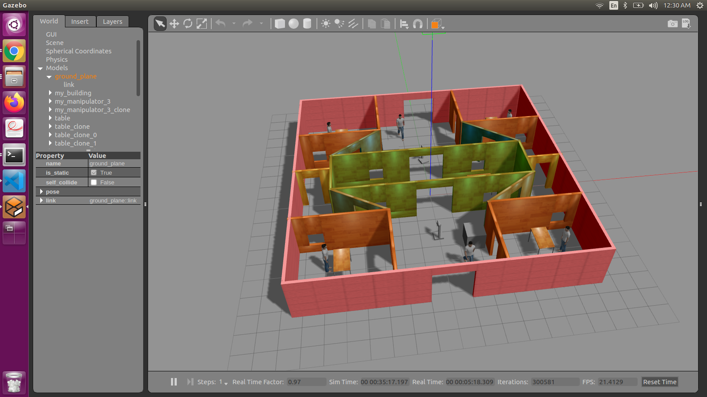
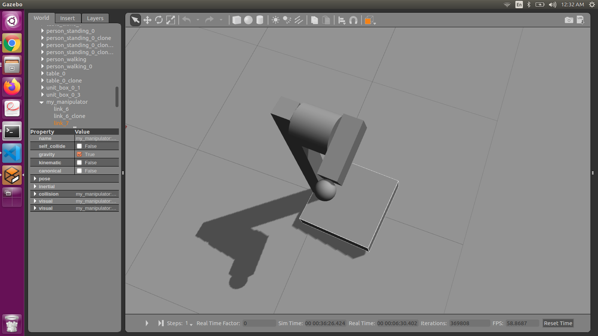
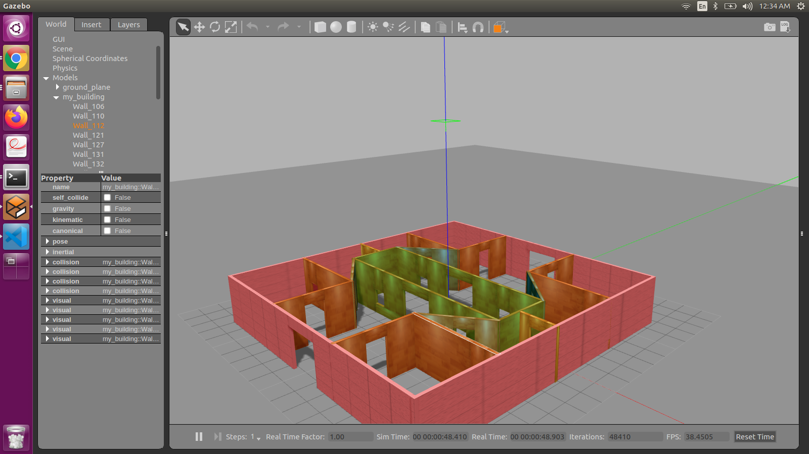

# Build-My-World-With-Gazebo
This project contains a gazebo simulated world, in reference to the project **Build My World** of the [Robotics Software Engineer Nanodegree](https://www.udacity.com/course/robotics-software-engineer--nd209) program offered by [Udacity](https://www.udacity.com/)

## Project-Directory 
The repo contains the files that are necessary for the working of gazebo world. The tree structure of the directories and files is as follows:

                            ├── build
                            │   └── CMakeFiles
                            │       ├── 3.5.1
                            │       │   ├── CompilerIdC
                            │       │   └── CompilerIdCXX
                            │       ├── CMakeTmp
                            │       └── hello.dir
                            │           └── script
                            ├── model
                            │   ├── my_building
                            │   └── my_manipulator
                            ├── script
                            │   ├── hello.cpp
                            └── world
                                └── build_my_world.world
                                
## How-To-Build-The-Project
1. Clone this repository.
2. Build the project using the following commands:
```
  $ cd /home/workspace/*this repo* 
  $ mkdir build
  $ cd build/
  $ cmake ../
  $ make # You might get errors if your system is not up to date!
  $ export GAZEBO_PLUGIN_PATH=${GAZEBO_PLUGIN_PATH}:/home/workspace/*this repo*/build 
  ```
3. Execute the project using the following commands:
```
  $ cd /home/workspace/*this repo*/world 
  $ gazebo buildmyworld 
  ```
   
## Screenshots-Of-The-Project

### Gazebo-World


### Models




  
  


